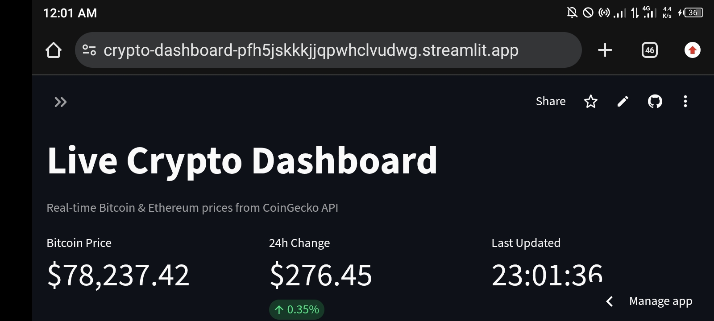

# Live Crypto Dashboard 📈

**Live Demo:** https://crypto-dashboard-pfh5jskkkjjqpwhclvudwg.streamlit.app/



Real-time cryptocurrency tracker for Bitcoin and Ethereum with interactive charts and key metrics.

### Features
- Live price data from CoinGecko API with 60s auto-refresh
- Interactive Plotly charts + 7-day moving average
- Adjustable history: 1-90 days via slider
- Key metrics: current price, 24h change %, market cap
- Responsive design for mobile/desktop

### Tech Stack
**Python** | **Streamlit** | **Pandas** | **Plotly** | **REST APIs**

### Run Locally
```bash
git clone https://github.com/miltonmason18-ops/crypto-dashboard.git
cd crypto-dashboard
pip install -r requirements.txt
streamlit run app.py
